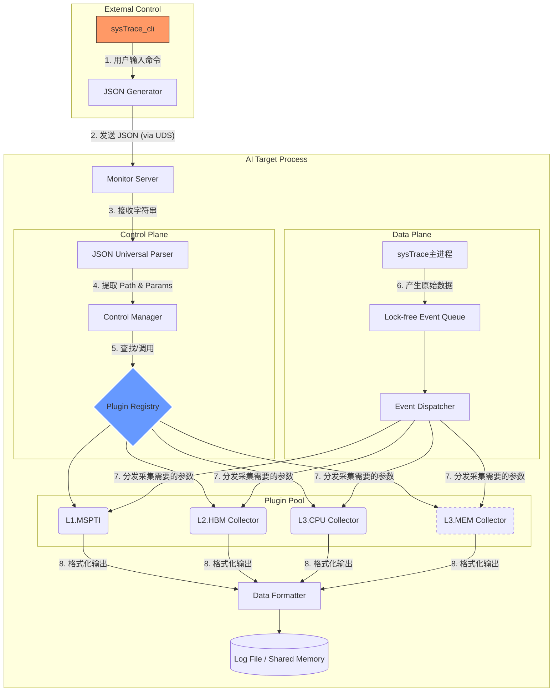
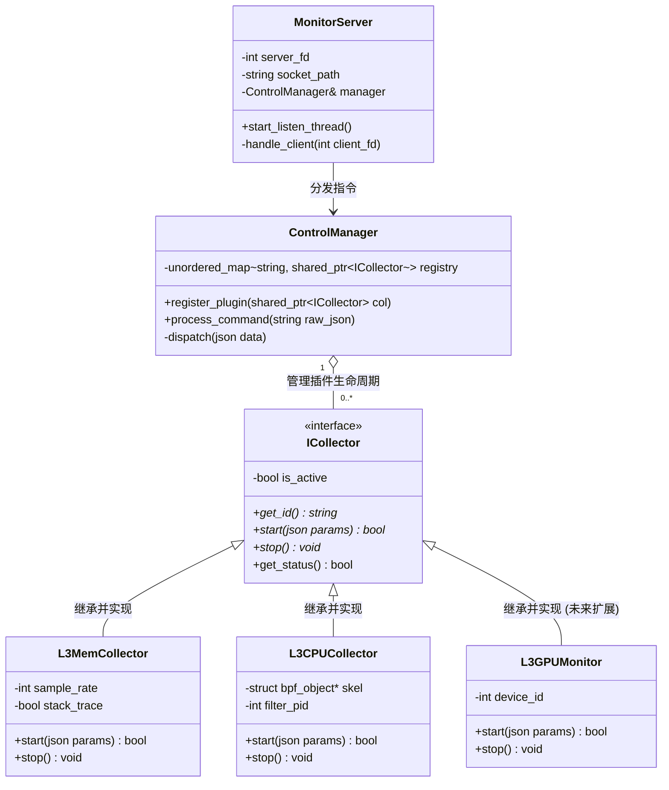
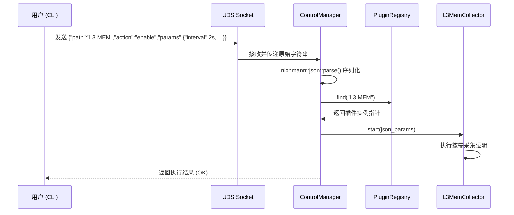

## 总体架构图



## 客户端设计：

- **命令格式：** `sysTrace_cli <action> <path> [key=value ...]`

- **JSON 组装逻辑：**

  ```c
  {
      "action": "enable",           # 动作：enable, disable, status, update
      "module": "L3.MEM",             
      "params": {                   # 动态参数：无需在框架层定义
          "interval": "100s",
          "stack": "true"
      }
  }
  ```

## 服务端设计：

### 类图



#### **MonitorServer**

- **职责**：启动一个独立的 POSIX 线程，监听 `sysTrace_cli` 的连接。

#### **ControlManager**

- **职责**：解析json，模块化使能采集功能。
- **关键属性**：如 `L3.mem.leak`）。通过这个 Map，它实现了 **O(1)** 复杂度的插件定位。
- **扩展性：新增采集模块功能时，仅需要注册对象。

#### **ICollector **

- **职责**：定义了插件的基本信息。
- **参数设计**：`start(json params)`。直接使用`json`对象，动态扩展，只保留共有的功能。
  - 不同插件 可以从param中取所需的参数

#### **采集模块实现类**

- **L3MemCollector**：按需采集`pagefault`事件。

- **L3CPUCollector**：按需采集`offcpu`,`oncpu`事件等。

**服务端和客户端通过本地socket通信，这个会和多个实例绑定，一个实例一个socket，**

## 序列图

